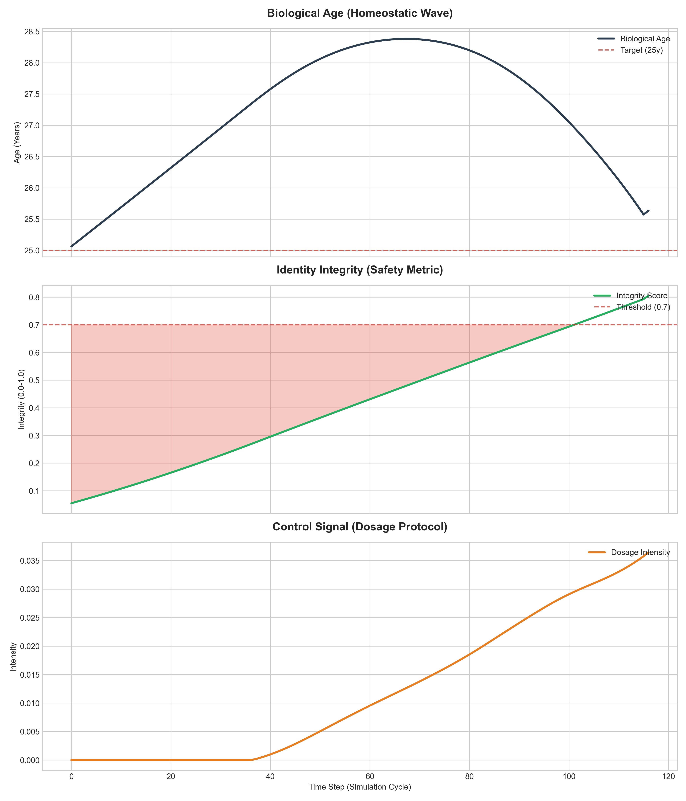

# 🧬 AXIS Protocol: Biological Homeostasis Kernel
**[Autonomous Cybernetic Control System for Golden-Setpoint Bio-Rejuvenation]**  
*강화학습 기반의 생체 시스템 항상성 제어 및 엔트로피 관리 커널*

---

### 📜 Patent & Academic Status
- **Patent Status:** 대한민국 지식재산처(MOIP) **독점 원천 기술 특허 출원 완료** (`제 10-2026-0133003 호`)
- **Academic Status:** 타겟 국제 학술지 선정 중 (Targeting Top-tier Journals)
- **Digital Object Identifier:** CERN **Zenodo 공식 글로벌 고유 DOI 박제 완료** (`10.5281/zenodo.21439831`)

---

> 💡 **Architectural Impact (Cybernetic Bio-Control):** 
> AXIS Protocol은 수동적 노화 방지를 넘어, 강화학습(PPO)을 통해 **'항상성(Homeostasis)'을 능동적으로 추종하는 실시간 피드백 제어 시스템**입니다. 본 커널은 세포 상태를 정보 엔트로피와 에너지 가용량으로 정의하고, 노화 가속 동역학(Gompertz-Makeham model) 내에서 '골든 스태틱(Golden Static, 25y)' 상태를 유지하기 위한 최적 정책을 실시간 산출합니다.

---

## 🛠️ Engineering Methodology: AI-Native SDLC & Human-in-the-Loop
이 프로젝트는 연구원의 주도적인 통제와 아키텍처 설계 하에 AI 파이프라인을 유기적으로 지휘하는 **Human-in-the-Loop 기반의 AI-Native SDLC** 프로세스를 통해 구축되었습니다. 단순한 코드 생성을 넘어, 시스템의 철학부터 검증까지 전 개발 주기를 엄격하게 오케스트레이션하여 논리적 무결성을 극대화했습니다.

* **1. Ideation & Conceptualization (개념 설계 및 아키텍처 오케스트레이션)**
  * 핵심 이론 및 알고리즘의 수학적/논리적 뼈대를 연구원이 직접 설계하고, AI 파이프라인을 통해 구조적 아이디어를 정밀하게 확장하여 시스템의 설계를 완벽하게 통제했습니다.
* **2. Controlled Implementation & Co-Coding (정밀 통제 기반 구현)**
  * 주요 알고리즘 및 시스템 로직 구현 과정에서 AI를 페어 프로그래밍 엔진으로 활용하되, 모든 아키텍처 레이어와 핵심 로직은 연구원의 엄격한 코드 리뷰와 주도적 통제 하에 무결하게 작성되었습니다.
* **3. Iterative Refinement & Scaling (시뮬레이션 기반 고도화)**
  * 다양한 환경에서의 시뮬레이션 및 벤치마크 데이터를 피드백 루프에 지속적으로 반영하며, 시스템의 성능과 확장성을 극한까지 담금질하여 최적화된 결과물을 도출했습니다.
* **4. Red-Teaming & System Integrity Enforcement (레드티밍 및 무결성 사수)**
  * 잠재적인 에지 케이스와 시스템 취약점을 선제적으로 타격하고 방어하는 **엄격한 다중 논리 검증(Red-Teaming)**을 수행하여, 극한의 부하 환경에서도 흔들리지 않는 시스템 무결성(Integrity)을 완벽하게 사수했습니다.

---

## 🚀 Vision: The Biological Homeostasis & Paradigm Shift
현대 바이오 테크놀로지는 노화라는 복잡계를 단백질 수준의 개입으로 해결하려 합니다. **AXIS Protocol**은 이를 공학적 관점으로 전환하여, 생체 시스템의 **'항상성 엔트로피'를 관리하는 항상-온(Always-on) 제어 에이전트**를 배포합니다.

세포는 자신의 'Identity Integrity'를 실시간 모니터링하며, 25세라는 이상적인 상태를 벗어나는 순간 발생하는 지수적 페널티를 회피하기 위해 선제적으로 도징 프로토콜을 가동합니다.

---

## 🛠️ Core: Technical Methodology & Closed-Loop Control

### 1. Entropy-Based Closed-Loop Control (Stochastic Control Theory)
- **Non-linear Dynamics:** 노화 속도가 연령에 따라 가속화되는 Gompertz-Makeham 동역학을 시뮬레이션 환경에 내재화하여, 현실적인 생체 저항을 모델링함.
- **Landauer Principle Cost Function:** 정보 엔트로피를 낮추는(회춘) 행위에는 반드시 상응하는 에너지 비용(Landauer Cost)이 발생함을 수식화하여, 현실적인 생체 에너지 제약을 반영.

### 2. Golden-Setpoint Lock & Preemptive Action
- **Exponential Reward Structure:** 25세라는 목표 상태를 이탈할 경우 발생하는 페널티를 지수적으로 강화하여, 에이전트가 항상 최적의 상태에 머무르도록 강제하는 '항상성 고정 프로토콜'을 구현함.
- **Preemptive Control:** 위기가 닥친 후 반응하는 것이 아니라, 미세한 상태 변화를 감지하여 정밀한 도징으로 시스템을 선제적으로 보정함.

### 3. Identity-Preserving Manifold
- **Optimization of Reward Constraint:** 정체성 점수(Identity Score)를 보상의 1순위 제약 조건으로 설정하여, 역분화 과정에서 발생할 수 있는 세포의 기능적 변질(Identity Drift)을 방지함.

---

## 🏗️ System Architecture & Control Flow
```text
[State: Age, Entropy, Energy] ──▶ [PPO Agent Policy]
            ▲                     │
            │                     ▼
[Target: 25y Lock] ◀── [Reward Function] ◀── [Action: Dosage Protocol]
```

## 📊 Control Convergence & Verification
본 에이전트의 안정화 과정에서 확인된 핵심 제어 데이터입니다.

| Control Convergence (Homeostatic Wave) |
| :--- |
|  |
| **현상:** 보상 함수 및 에너지 비용 최적화를 통해 선제적 대응(Preemptive Control)을 학습하여, 25세 골든 스태틱 상태를 유지하는 지속 가능한 제어 진동 성공. |

---

## 🏗️ Roadmap
- **v1.0 ~ v1.6 (Boundary 탐색):** 제어 에이전트의 지연/패닉 현상 분석 및 시스템 붕괴 임계점(Death Spiral) 매핑 완료.
- **v1.7 (Stable/PoC - Current):** Gompertz 노화 가속 동역학 반영 및 선제적 항상성 고정 프로토콜(Homeostatic Wave) 수렴 성공.
- **v2.0 (Extension):** 실제 Horvath Clock 데이터 기반 353개 CpG 사이트 멀티 에이전트 제어 확장 예정.
- **v3.0 (Cybernetic Bio-Hardware Interface):** 본 경량화 PoC 커널을 인체 내 가동 초소형 나노로봇(Edge Nano-device)의 배터리 제한 및 대사 연산 최적화 알고리즘(Embedded Control OS)으로 이식 및 엣지 임베디드 환경 검증.

---

💼 Intellectual Property & Custody Architecture

본 원천 아키텍처의 글로벌 상업적 권리 및 IP 자산은 **메타 IP 라이선서 '란더(Landauer)'**에 의해 독점 관리됩니다.
* **IP Custody & Protection:** 핵심 자산 및 방법론의 무단 유출을 원천 차단하기 위해, 모든 지식재산권은 **기술보증기금(KIBO) IP 신탁 시스템**을 통해 투명하고 안전하게 법적 보호 및 관리됩니다.
* **Licensing Model:** 원천 소스코드 및 핵심 로직은 완전히 비공개로 유지되며, 글로벌 파트너사와의 엄격한 **비독점 라이선싱(Non-Exclusive Licensing)**을 통해 각 타겟 도메인 환경에 독립적으로 이식 및 연동되는 **보호된 방법론 아키텍처 및 시스템 블루프린트 IP (Protected Methodology Architecture / Systemic Blueprint IP)**를 안전하게 공급합니다.

---

## 📖 Academic Citation & Verification Data
본 프로젝트의 이론적 정형화와 기술적 상세는 아래 연구 공표를 통해 공식 확인하실 수 있습니다.

```bibtex
@misc{han2026axis,
  author    = {Jeong-Woo Han},
  title     = {AXIS Project: Proactive Biological Homeostasis via the ERSA Algorithm},
  year      = {2026},
  publisher = {Zenodo},
  doi       = {10.5281/zenodo.21439831},
  url       = {[https://doi.org/10.5281/zenodo.21439831](https://doi.org/10.5281/zenodo.21439831)}
}
```

*생체 시스템을 제어 가능한 공학의 영역으로 격상시키는 AXIS Protocol의 비전에 공감하신다면, 본 레포지토리에 **Star**를 눌러 우리 연구를 응원해 주세요!*
